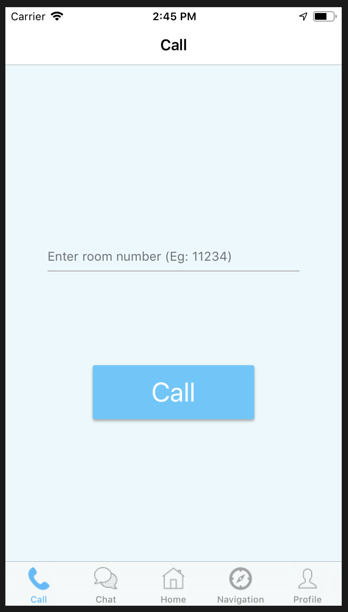

# SWEDEN_iCare

# IT Project

# Prerequisites 

##### You will need XCode version 10.0 or later.

##### This application is optimized for an iPhone 8 device.

# 1. How to build this project

##### git clone https://github.com/COMP30022-18/SWEDEN_iCare.git

##### Open the project using XCode

##### This project can be run using the emulator.
##### However, video call, calls and navigation work better on real devices.

# 2. Team members 

##### Dimosthenis Goulas 
###### dgoulas@student.unimelb.edu.au

##### Jing Kun Ting      
###### ting2@student.unimelb.edu.au

##### Weijia Wang
###### weijiaw3@student.unimelb.edu.au

##### Yangxuan Cho
###### yangxuanc@student.unimelb.edu.au

##### Zheng Wei Lim
###### limz2@student.unimelb.edu.au

# 3. How this project works 

### a) Login and Sign-up

##### In order to sign up, click the button below and enter an email address and a password of at least 8 digits.

### b) Home Screen

### c) Friend requests

##### To send a friend request, you will need to click on an email, and click send.

##### The other party will have to accept the friend request from their end.

### d) Video and Voice Call

##### In order to initiate a call, you will need to use 2 real iOS devices. 

1. User one will choose a unique 4-8 digit room number, and enter it.

2. User one will then set up the room automatically and wait for other users to connect.

3. User two will then enter the same room number that user one has entered. 

4. Video call is then set up between these two devices. 

### e) Chat Message

##### In order to send a chat message, you will need to be friends with other users. (See Friend requests on how to be friends with other users)

##### Click on the user's email and you will be able to send messages.

### f) Navigation

##### In order for navigation to work, you will have to allow this app to use your location.

#### f)i) Navigation

##### To navigate to your designated address, you simply need to enter where you want to go and how you want to get there (Drive or Walk)

#### f)ii) Location Sharing

  

##### In order for location sharing to work, you will need to allow your "carer" to view your location, by giving them permission.

##### Once permission have been given, the carer will be able to monitor the elderly person's location and let them know whether they have made a right or wrong turn.

# 4. Testing modules

##### The testing modules could be found in SWEDEN_iCareTests and SWEDEN_iCareUITests.

##### Modules used include XCTest. 

# Enquiries

##### For any other enquiries, feel free to email any one of us in the email provided above.

